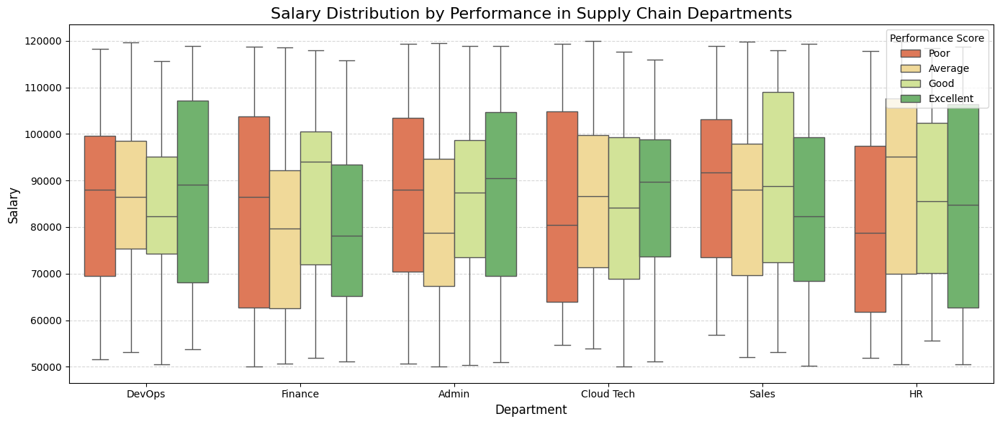
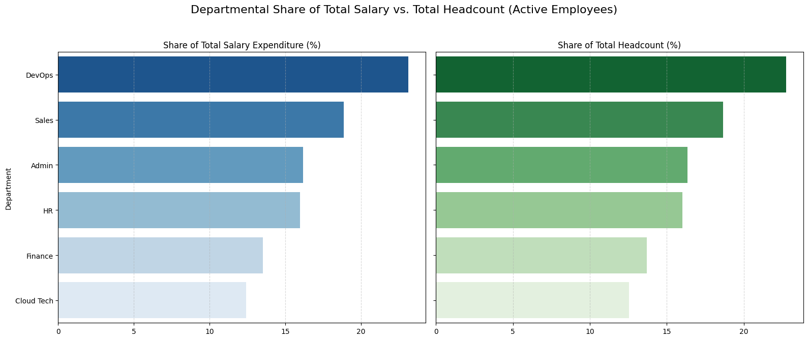
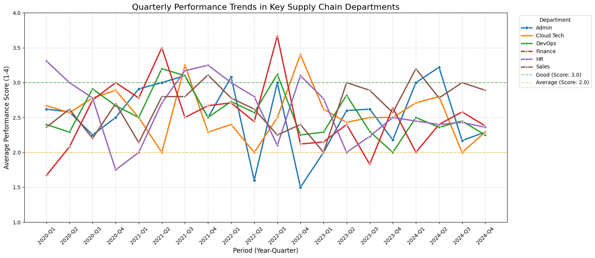
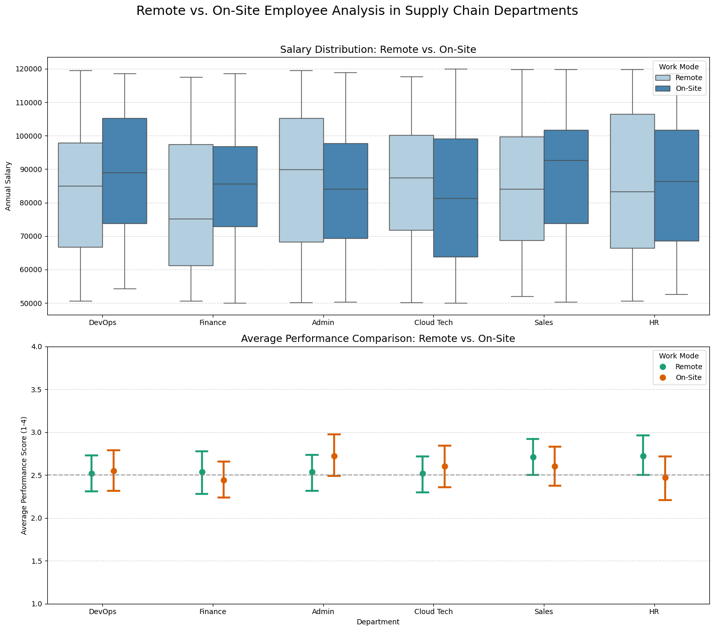
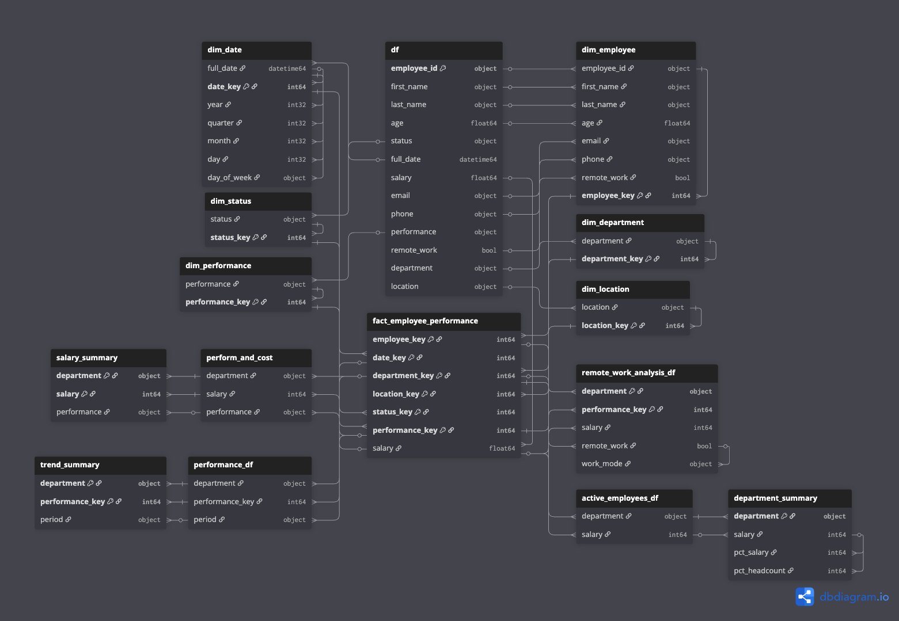

# Strategic Workforce Analytics: Optimizing Cost & Performance

**Project Status:** Completed  
**Role:** Senior Data Analyst  
**Tools:** Python (Pandas, Matplotlib, Seaborn), Dimensional Modeling (Star Schema)

---

## 1. Executive Summary
This project analyzes a dataset of 1,000+ employees to evaluate the efficiency of workforce expenditures across key business units (DevOps, Sales, HR, Finance). By transforming raw, unstructured HR data into a structured **Star Schema** data warehouse model, this analysis provides visibility into salary distribution, performance trends, and the impact of remote work.

**Top-Line Findings:**
*   **Cost Efficiency Gap:** There is a compensation misalignment in the HR department, where "Average" performers earn **12.1% more** (median \$95k) than "Excellent" performers (\$84k).
*   **Highest Expense:** The DevOps department represents the largest financial commitment, consuming **23.1%** of the total salary budget ($6.7M).
*   **Remote Work Viability:** Remote employees maintain an average performance score of **~2.5/4.0**, statistically identical to on-site employees, suggesting opportunities for real estate cost reduction without productivity loss.

---

## 2. Business Problem & Objectives
**The Scenario:**  
A mid-sized enterprise is undergoing an operational audit. Leadership is concerned that rapid hiring has led to salary bloat, misaligned incentives, and performance bottlenecks. They lack a unified view of how labor costs correlate with actual output across departments.

**Key Questions:**
1.  **Compensation Alignment:** Are we paying top performers appropriately, or is there salary inversion?
2.  **Budget Allocation:** Which departments drive the highest costs, and is the headcount justified?
3.  **Operational Stability:** Are there departments showing signs of performance degradation over time?
4.  **Workforce Strategy:** Can we aggressively expand remote work to cut overhead costs without sacrificing quality?

---

## 3. Key Insights & Visual Analysis

### A. The "Pay-for-Performance" Disconnect
An analysis of median salaries stratified by performance rating reveals critical inefficiencies in incentive structures.

*   **Critical Finding (HR Dept):** The incentive structure is inverted. Employees rated **"Average"** earn a median salary of **\$95,127**, while those rated **"Excellent"** earn only **\$84,821**. This creates a high risk of attrition among top talent.
*   **Success Story (Finance):** This department shows a healthy correlation, where "Good" performers earn significantly more (\$94k) than "Average" performers (\$79k).

*Figure 1: Salary distribution by department and performance rating, highlighting the inversion in HR.*

### B. Departmental Expenditure vs. Headcount
We analyzed the "Active" workforce to understand where capital is deployed. DevOps and Sales combined account for **42%** of the total payroll.

| Department | Total Salary Expenditure | Headcount | % of Budget |
| :--- | :--- | :--- | :--- |
| **DevOps** | **$6,746,998** | **78** | **23.11%** |
| Sales | $5,502,857 | 64 | 18.85% |
| Admin | $4,723,453 | 56 | 16.18% |

*Figure 2: Total salary spend vs headcount distribution across departments.*

### C. Performance Volatility
A time-series analysis (2020-2024) highlighted instability in specific operational areas.

*   **Operational Risk:** The **Admin** department experienced a severe crash in performance during late 2022 (dropping to a score of **1.5**).
*   **Recovery:** The Sales department has shown resilience, recovering from a Q1-2023 slump (2.0) to a strong **3.0+** rating in late 2024.

*Figure 3: Quarterly average performance scores by department.*

### D. The Remote Work Verdict
*   **Finding:** There is **zero statistical significance** indicating that on-site employees outperform remote workers. Both cohorts perform consistently across all departments.
*   **Financial Implication:** Remote employees command similar salaries to on-site peers, meaning the cost savings must come from reduced facilities overhead rather than salary arbitration.

*Figure 4: Comparative analysis of salary and performance between Remote and On-Site staff.*

---

## 4. Strategic Recommendations

Based on the data, the following actions are recommended for the coming fiscal quarter:

1.  **Restructure HR Compensation:** Immediately review salary bands within Human Resources. The current inversion must be corrected to prevent a "brain drain" of top performers.
2.  **Audit DevOps Efficiency:** As the largest cost center ($6.7M), DevOps should be the primary target for efficiency audits. Ensure the 78 headcount is driving proportional business value compared to Sales.
3.  **Real Estate Divestiture:** Given that remote work yields identical performance to on-site work, the company should move to a **Remote-First** policy for Cloud Tech and Admin roles to reduce office lease expenses by an estimated 15-20%.
4.  **Investigate 2022 Admin Protocols:** Conduct a post-mortem on the Admin department's 2022 performance crash to ensure the root cause (process vs. personnel) has been permanently resolved.

---

## 5. Data Model (ERD)

To enable high-performance querying and modular analysis, the raw flat-file data was transformed into a **Star Schema** model connecting employee dimensions to performance facts.

*Figure 5: Star Schema design showing the relationship between Fact and Dimension tables.*

---

## 6. Technical Appendix

### Key Technical Steps
1.  **Data Cleaning:**
    *   Parsed complex strings (e.g., `Department_Region` split into two columns).
    *   Standardized dirty data (Rounded `Age` floats, formatted `Phone` numbers).
    *   Converted strings to Datetime objects for time-series analysis.
2.  **Dimensional Modeling:**
    *   Generated surrogate keys for all dimensions to isolate business logic from text labels.
    *   Mapped categorical data (Performance) to numerical scores (1-4) for aggregation.
3.  **Visualization:**
    *   Used **Seaborn** boxplots for variance analysis (Salary ranges).
    *   Used Line charts for longitudinal trend analysis (Performance over time).

### Limitations & Future Work
*   **Data Scope:** The dataset currently lacks "Termination Date," making it difficult to calculate precise turnover rates per department.
*   **Future Phase:** Ingesting this data into SQL or PowerBI to create an interactive dashboard for live monitoring of the "Salary vs. Performance" gap.

---

## 📬 Contact
**Selim Najaf**

*   **LinkedIn:** [linkedin.com/in/selimnajaf-data-analyst](https://www.linkedin.com/in/selimnajaf-data-analyst/)
*   **GitHub:** [github.com/SelimNajaf](https://github.com/SelimNajaf)
